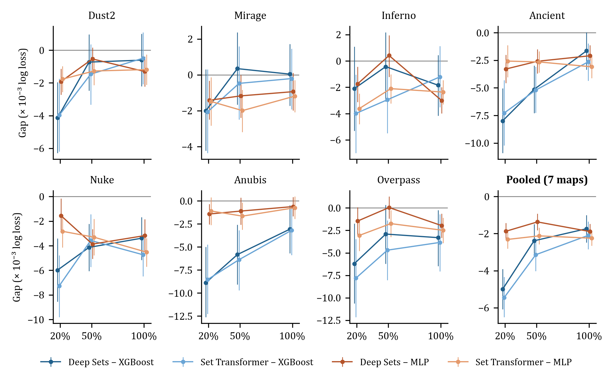
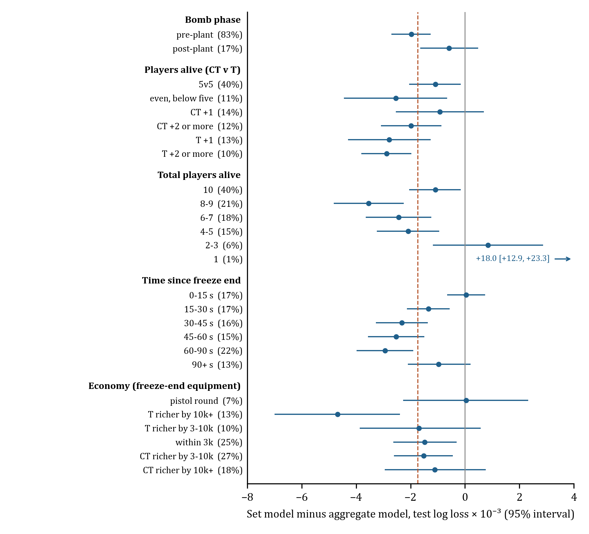
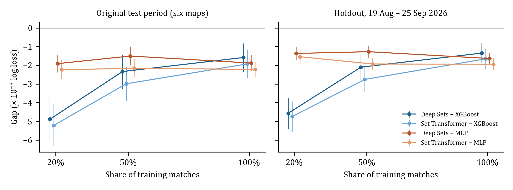
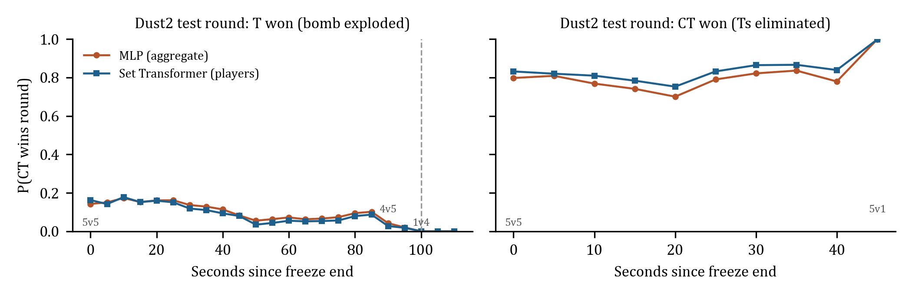

# CS2RB: Aggregate and Individual-Player Models for Round-Win Prediction in Counter-Strike 2

**William Bishop** · Independent researcher

Version 1.0 · September 2026 · Data: https://doi.org/10.5281/zenodo.22970589 · Code and results: https://github.com/williambishop-research/cs2rb

## Abstract

Round-win probabilities help analysts review Counter-Strike rounds. We ask how the advantage of individual-player models over aggregate models changes as training data grow. CS2RB v1.0 contains 4,768,984 live states from 12,742 professional Counter-Strike 2 map recordings (5,725 matches on seven maps, January–August 2026). States in which the round is already decided are removed by rules that use only information available at that moment, validated against exact events re-parsed from raw recordings. Under frozen chronological splits, we fit XGBoost and a multilayer perceptron (MLP) on 28 team-level features. We also fit Deep Sets and a Set Transformer, which add one vector per player. Each model is trained on 20%, 50% and 100% of the training matches with four seeds (336 fits), and models are selected on validation data only. Pooled over maps, the validation-selected set model has lower test log loss than the selected aggregate model at every scale: by 2.33 × 10⁻³ (95% interval 1.90–2.78) at 20% and 1.74 × 10⁻³ (1.09–2.41) at 100%. The change, +0.59 × 10⁻³ (−0.17 to +1.35), is not distinguishable from zero. Against XGBoost alone, the advantage narrows by about 3.3 × 10⁻³, because gradient boosting gains most from additional data; against the MLP it does not change. In a pre-specified descriptive breakdown, the advantage concentrates before the bomb plant and after the opening kills, and is absent at round start and in pistol rounds. In a pre-registered holdout of 1,192,077 states from 1,536 later matches that no part of the study had seen, the same models reproduce the result: the selected gap at full scale is 1.73 × 10⁻³ (1.22–2.23). The advantage survives tuning the aggregate models (1.36 × 10⁻³). At a fixed architecture, per-player spatial state adds nothing at 20% of the data but 0.85–0.89 × 10⁻³ at 100%. The player-level advantage is small, persistent and varies by map. The data, code and outputs of all fits are public.

## 1 Introduction

During a Counter-Strike round, an analyst can see that a kill, a bomb plant or a change in positioning alters the situation. A round-win model puts those changes on a common probability scale. It estimates the chance that the defending side (CT) wins from the current state; the attacking side (T) wins by eliminating the defenders or by planting the bomb and letting it explode. Such estimates support round review and underlie win-probability-added approaches to valuing actions [1, 3].

An analyst building this model faces a representation choice. Team summaries capture players alive, total health, equipment and distance to the bombsites. Individual-player models also keep who is positioned where, facing which direction and moving how fast. Those details can separate situations whose team summaries look alike, but a model has to learn from data how they relate to the outcome.

**How does the predictive advantage of individual-player models over aggregate models change as training data grows?** This is the central question of CS2RB. On the ESTA dataset, an aggregate-feature multilayer perceptron outperformed the tested set models [4]. That result leaves open whether a larger training corpus changes the comparison.

CS2RB examines the question in the current game, using one corpus, common evaluation states and nested subsets of training matches. On seven maps it compares two aggregate models (gradient-boosted trees and a multilayer perceptron) with two permutation-invariant set models (Deep Sets and a Set Transformer) that receive the same aggregate features plus one vector per player. The comparison is between complete modelling approaches that differ in both inputs and architecture. The contributions are:

- **A corpus of live CS2 round states.** It holds 4,768,984 states from 12,742 professional map recordings. Each state is checked by rules that use only information available at that moment, and the checks are validated against exact events re-parsed from raw recordings.
- **A fixed comparison protocol.** It uses frozen chronological splits, nested training subsets, four optimisation seeds per model and validation-only model selection, with paired match-level uncertainty for every contrast.
- **A scaling result, reported per architecture.** Both set models have lower test loss than both aggregate models at every training scale in the pooled estimates. Their advantage over XGBoost narrows as data grow, but their advantage over the validation-selected aggregate model does not change detectably.
- **A pre-registered confirmation.** On 1,536 later matches that no part of the study had seen, analysed under a protocol published before the analysis ran, the same models reproduce the result. It also survives tuned aggregate baselines and a same-architecture ablation of player space.

Section 2 reviews related work. Section 3 describes the corpus and its eligibility checks, and Section 4 the experimental protocol. Section 5 reports the scaling trajectories, full-scale results, a breakdown by game situation, the holdout confirmation and two robustness checks, and Section 6 a round-review use of the models. Section 7 discusses limitations.

## 2 Related work

Xenopoulos et al. [1] built a round-win model over aggregate CS:GO state and valued damage events through changes in its predicted probability. Their test matches are dated after all their training matches, a chronological evaluation precedent that CS2RB follows. Work on economic decisions predicts outcomes at the start of a round [2], a different target from the mid-round prediction studied here.

Player-level representations are another way to model a game state. Xenopoulos and Silva [5] combined graph and aggregate inputs and reported lower loss than a feature-vector model on the same CS:GO data. Szmida and Toka [3] used temporal heterogeneous graphs for CS2 prediction, with Shapley-based explanations of action-associated probability changes. These approaches motivate keeping spatial relationships. Differences in corpus, sampling and evaluation prevent a direct ranking of their published losses against CS2RB.

ESTA is the closest dataset and representation comparison [4]. It contains 1,558 professional CS:GO recordings, 41,782 rounds and 7.9 million frames sampled at 2 Hz. Its aggregate-feature MLP achieved lower log loss than both Deep Sets and Set Transformer on each of seven maps. CS2RB has 8.2 times as many recordings and 6.5 times as many rounds, but fewer states, because it samples about every five seconds. Our question concerns the effect of more training matches within CS2RB, not a comparison of scores across the two datasets.

Deep Sets [6] and Set Transformer [7] are permutation-invariant architectures for collections of objects. They suit this task because a round contains players whose listing order should not affect the prediction. We use small reference architectures from both families. Each also receives the aggregate vector, so the player representation adds to the same global context rather than replacing it.

## 3 The CS2RB dataset

### 3.1 Corpus and sampling

CS2RB contains professional CS2 map recordings from matches played between 22 January and 18 August 2026. Publicly available match demos were parsed with demoparser2/awpy into position files holding about one observation per player per second: position, view direction, health, side and map callout. A match can contain several maps, and each map recording contains many rounds. The corpus comprises 12,742 recordings from 5,725 matches, with 273,053 rounds and 4,768,984 states (Table 1).

The end of freeze time is estimated as the first observation with player movement. From there, every fifth observation is kept, giving a state about every five seconds for up to 155 s of round time. Against database freeze-end timestamps available for 34,299 rounds, the estimate falls a median 0.58 s after the true freeze end, and 99.98% of estimates are within 2 s.

**Table 1. Corpus composition.** Matches are counted per map; a match can appear on several maps.

<!-- TABLE1:start -->
| Map | Recordings | Rounds | States | Train / val. / test matches | Test period (2026) |
|---|---:|---:|---:|---:|---:|
| Dust2 | 2,595 | 55,245 | 980,813 | 1,816 / 389 / 390 | 17 Jul – 18 Aug |
| Mirage | 2,248 | 47,837 | 799,712 | 1,574 / 336 / 338 | 19 Jul – 18 Aug |
| Inferno | 1,561 | 33,361 | 628,740 | 1,093 / 234 / 234 | 18 Jul – 18 Aug |
| Ancient | 2,097 | 45,185 | 738,019 | 1,470 / 312 / 315 | 18 Jul – 18 Aug |
| Nuke | 2,090 | 44,797 | 767,221 | 1,463 / 313 / 314 | 15 Jul – 18 Aug |
| Anubis | 1,120 | 24,315 | 435,812 | 784 / 168 / 168 | 25 Jul – 18 Aug |
| Overpass | 1,031 | 22,313 | 418,667 | 722 / 154 / 155 | 28 May – 3 Jul |
| Total | 12,742 | 273,053 | 4,768,984 |  |  |
<!-- TABLE1:end -->

### 3.2 State representations

The aggregate representation has 28 features: alive count and total health per side; elapsed time; bomb status, plant site and time since the plant; freeze-end equipment value and buy class per side; a pistol-round indicator; each side's minimum and mean distance to each bombsite centre; the number of each side's players on a bombsite; and positional spread. Bombsite centres are estimated only from training-period recordings.

The individual-player representation adds ten token slots, five per side. Each token records side, x/y/z position, sine and cosine of view yaw, health, an alive flag, and horizontal velocity (a trailing difference over the previous observation). Dead players' kinematics are zero, and no player identifiers are included. Slots are filled with living players first, so every living player is represented. The set models are permutation-invariant, so slot order carries no information.

### 3.3 Live states only

A round is decided at a specific moment, but recordings continue for several seconds afterwards. Including those seconds would reward models for recognising finished rounds. CS2RB therefore excludes a state when the state itself shows that the round is over:

- no CT player is alive;
- no T player is alive and no bomb is planted;
- the bomb was planted at least 40 s ago;
- at least 115 s have elapsed without a plant.

It also excludes states with more than five living entities on one side (usually a coach present in the first frames), and whole rounds whose freeze end was not observed. Every rule uses only information available at that state's own tick. Together the rules remove 328,264 states (6.4%) and no whole match.

We validated the rules against exact events. From 48 surviving raw recordings, we re-parsed the freeze-end, plant and decisive-resolution ticks of 962 rounds.

- **Live states.** Of the 16,747 live states in those rounds, the rules keep 16,730.
- **States after the decision.** 1,309 exported states fell after the decision, and the rules remove 91% of them. The remaining 121 are 0.72% of kept states. 120 fall in the seconds after a bomb defusal (median 2.9 s), which the state features cannot show.
- **Plant flag.** The plant indicator never turned on before the actual plant; it lagged by under a second in 61 states.

These recordings are a convenience sample drawn mostly from the training and validation periods. We therefore also checked the plant indicator against database plant timestamps for 18,608 later rounds. One round was wrong, with the flag on up to 29 s early in 6 states, because 31 s of frames had been removed during its freeze time. Section 5.3 tests whether the residual post-defusal states affect the conclusions. All audit inputs are released.

## 4 Experimental design

### 4.1 Task, metric and partitions

For a state *x* in a round with outcome *y* (1 if CT wins), the target is P(*y* = 1 | *x*). Log loss is the primary metric, with probabilities clipped to [10⁻⁶, 1 − 10⁻⁶] and natural logarithms. Losses average over states, so rounds with more states carry more weight; a round-weighted version is reported as a sensitivity.

Each map has its own model. Within a map, matches are ordered by date. The 70th and 85th percentiles of match timestamps divide training, validation and test. All states of a match stay in one partition, and every test match is later than every training and validation match (Appendix A). The partition roles were frozen before any v1.0 model was fitted.

### 4.2 Models

The two aggregate models are XGBoost and a two-layer multilayer perceptron (MLP), each on the 28 aggregate features. The two individual-player models are Deep Sets, which pools player embeddings by mean and maximum, and a Set Transformer with two self-attention blocks followed by mean pooling. Both combine the pooled player representation with the 28 aggregates before the output layers. Appendix C gives all settings. Every model stops on the chronological validation partition: XGBoost after 50 boosting rounds without improvement, the MLP after five epochs without improvement and the set models after three. Neural models are capped at 40 epochs. Standardisation uses training rows only.

### 4.3 Training scales, seeds and selection

Training matches are ordered by date and match ID, permuted once with seed 42, and the first 20%, 50% and 100% form nested training subsets. Validation and test states are the same at every scale, and every model sees the same subsets. Each model is fitted with four optimisation seeds (7, 123, 2024, 31337) at every map and scale: 7 maps × 3 scales × 4 seeds × 4 models = 336 fits. The benchmark score is the mean of the four individual-fit test losses; seed standard deviations are reported separately.

We report every architecture and all four fixed aggregate/set pairs. For a single summary per cell, a *selected* pair takes the aggregate model and the set model with the lower mean validation loss; test data never select a model. The protocol, model code and selection rule were fixed on 6 September 2026, before the v1.0 corpus was built. An earlier, unreleased version of this study had used the same test period, so the results in Sections 5.1–5.4 are a corrected retrospective evaluation. Section 5.5 tests them prospectively on later matches, under a protocol published before that analysis ran.

### 4.4 Uncertainty

The *gap* is the set model's loss minus the aggregate model's loss; negative values favour the set model. Its change with scale is the gap at 100% minus the gap at 20%. For each state we average the loss difference over the four seeds. We then resample whole test matches 10,000 times, with the same resampled matches used for every model and scale, and report percentile 95% intervals. A match that appears on several maps is resampled as one unit in the pooled seven-map estimates. The intervals describe test-match sampling for these fitted models and this training draw. Seed variation is reported separately, and there is no adjustment for multiple comparisons.

## 5 Results

### 5.1 How the gap changes with training data

Figure 1 and Tables 3 and B2 give the gaps. In the pooled estimates at 20% of training matches, both set models have lower loss than both aggregate models, by 1.9–5.5 × 10⁻³. How the gap changes with more data depends on the aggregate model it is measured against.

- **Against XGBoost, the gap narrows.** Pooled, the Deep Sets advantage falls from 5.00 to 1.74 × 10⁻³ (change +3.27, 95% interval +2.31 to +4.23) and the Set Transformer advantage from 5.45 to 2.10 × 10⁻³ (change +3.35, +2.38 to +4.30). The change is positive for both set models on all seven maps.
- **Against the MLP, it does not.** The Deep Sets and Set Transformer gaps are −1.87 and −2.31 × 10⁻³ at 20% and −1.89 and −2.25 × 10⁻³ at 100%. The pooled changes are −0.02 (−0.52 to +0.49) and +0.07 (−0.44 to +0.56).

The difference comes from the aggregate models themselves. The MLP has lower test loss than XGBoost at 20% on all seven maps, by up to 7.5 × 10⁻³. At full scale the two are within 2.5 × 10⁻³ of each other, and XGBoost is ahead on four maps (Table B1). Gradient boosting therefore gains more from additional matches. A comparison that used XGBoost as its only aggregate baseline would report a shrinking player-level advantage that a comparison against the MLP does not show.

The validation-selected pair combines these effects. The selected aggregate model is the MLP at 20% on every map and XGBoost at full scale on five of seven maps. Pooled, the selected set model's advantage is 2.33 × 10⁻³ (1.90–2.78) at 20%, 2.25 × 10⁻³ at 50% and 1.74 × 10⁻³ (1.09–2.41) at 100%. The change, +0.59 × 10⁻³ (−0.17 to +1.35), is not distinguishable from zero. For these fitted models, the interval rules out a narrowing larger than 1.35 × 10⁻³ between 20% and 100%.

Across maps, the selected gap at full scale is negative everywhere, and its interval excludes zero on Ancient, Nuke and Overpass. On Nuke the advantage widens with data (change −1.91, −3.87 to −0.03). Seed-to-seed standard deviations of the selected single-map gaps (0.4–2.7 × 10⁻³) are of the same order as the gaps themselves. Single-map differences should therefore be read together with the intervals and the seed spread, and the pooled estimates are the primary summary.

<!-- FIGURE1:start -->

**Figure 1. Set-model minus aggregate-model test log loss (× 10⁻³) against the share of training matches**, for each fixed pair, by map and pooled. Points are means over four seeds; bars are 95% match-bootstrap intervals. Below zero favours the set model. Points are offset horizontally for legibility.
<!-- FIGURE1:end -->

<!-- TABLE3:start -->
**Table 3. Set model minus aggregate model, test log loss × 10⁻³** (95% match-bootstrap interval), for the validation-selected pair in each cell. Negative gaps favour the set model; a positive change means the set model's advantage narrowed.

| Map | Gap at 20% | Gap at 50% | Gap at 100% | Change, 20% → 100% |
|---|---:|---:|---:|---:|
| Dust2 | −1.92 [−2.72, −1.14] | −1.27 [−2.13, −0.42] | −0.49 [−2.07, +1.09] | +1.43 [−0.40, +3.26] |
| Mirage | −1.42 [−2.49, −0.32] | −0.47 [−2.48, +1.59] | −0.21 [−1.92, +1.46] | +1.21 [−0.70, +3.10] |
| Inferno | −3.62 [−4.81, −2.48] | −2.10 [−3.22, −1.01] | −1.21 [−3.52, +1.14] | +2.41 [−0.24, +5.14] |
| Ancient | −3.29 [−4.57, −2.02] | −5.20 [−7.27, −3.09] | −2.65 [−4.35, −0.97] | +0.65 [−1.45, +2.79] |
| Nuke | −2.83 [−4.13, −1.56] | −3.31 [−4.78, −1.81] | −4.73 [−6.48, −3.05] | −1.91 [−3.87, −0.03] |
| Anubis | −1.42 [−2.57, −0.33] | −1.65 [−3.12, −0.17] | −0.61 [−1.68, +0.43] | +0.81 [−0.59, +2.19] |
| Overpass | −1.46 [−3.00, +0.09] | −1.74 [−3.23, −0.25] | −2.49 [−3.90, −1.09] | −1.03 [−3.05, +0.93] |
| **Pooled** | −2.33 [−2.78, −1.90] | −2.25 [−2.86, −1.65] | −1.74 [−2.41, −1.09] | +0.59 [−0.17, +1.35] |
<!-- TABLE3:end -->

### 5.2 Full-scale performance

At full scale (Table 2), a set model has the lowest mean test loss on every map. On Dust2, Mirage and Anubis the best aggregate model is within 0.7 × 10⁻³ of it; on Inferno, Ancient, Nuke and Overpass the difference is 1.9–4.6 × 10⁻³. These differences are small next to the effect of more data. Going from 20% to 100% of the training matches reduces XGBoost's test loss by 6.3–11.2 × 10⁻³ and the Set Transformer's by 4.0–6.2 × 10⁻³, depending on the map.

The set models cost more to train. The 84 Set Transformer fits took 13.5 hours in total at four CPU threads per fit, against 0.3 hours for the 84 XGBoost fits (Table B5). No fit reached its epoch or tree cap: every model stopped on its validation criterion, the neural models after 5–16 of 40 epochs and XGBoost after 131–307 of 800 trees.

<!-- TABLE2:start -->
**Table 2. Full-scale test log loss** (mean of four seeds ± seed SD). An asterisk marks the model each track selects on validation loss.

| Map | XGBoost | MLP | Deep Sets | Set Transformer |
|---|---:|---:|---:|---:|
| Dust2 | 0.4510 ± 0.0001* | 0.4517 ± 0.0006 | 0.4504 ± 0.0005 | 0.4505 ± 0.0005* |
| Mirage | 0.4488 ± 0.0003* | 0.4498 ± 0.0007 | 0.4489 ± 0.0004 | 0.4486 ± 0.0005* |
| Inferno | 0.4604 ± 0.0004* | 0.4615 ± 0.0008 | 0.4585 ± 0.0006 | 0.4591 ± 0.0010* |
| Ancient | 0.4478 ± 0.0002* | 0.4483 ± 0.0006 | 0.4462 ± 0.0013 | 0.4452 ± 0.0006* |
| Nuke | 0.4518 ± 0.0001* | 0.4516 ± 0.0007 | 0.4484 ± 0.0009 | 0.4470 ± 0.0009* |
| Anubis | 0.4490 ± 0.0004 | 0.4465 ± 0.0008* | 0.4459 ± 0.0020* | 0.4458 ± 0.0014 |
| Overpass | 0.4519 ± 0.0002 | 0.4506 ± 0.0015* | 0.4486 ± 0.0007 | 0.4481 ± 0.0005* |
<!-- TABLE2:end -->

### 5.3 Sensitivity checks

Three checks leave the conclusions unchanged.

- **Residual post-decision states.** We rescored the same test predictions after also removing every state within 10 s of its round's last exported frame. This filter uses the round's end, so it is a sensitivity check rather than a benchmark rule. It removes 5.4% of test states and, on the audited rounds, all but 6 of the 121 remaining post-decision states. The pooled selected-pair change becomes +0.47 × 10⁻³ (−0.33 to +1.26). The changes against XGBoost become +3.25 and +3.31, and against the MLP +0.04 and +0.10.
- **Weighting.** Weighting every round equally instead of every state gives a selected-pair change of +0.02 × 10⁻³ (−0.67 to +0.70), with gaps of −1.91, −2.22 and −1.90 × 10⁻³ at the three scales (Table B4).
- **Reproducibility.** Refitting a job on the same machine and package versions reproduces its predictions bit for bit; we checked this for XGBoost, MLP and Deep Sets fits.

### 5.4 Where the advantage comes from

To see where the player-level advantage arises, we split the full-scale test states of the validation-selected pair by game situation (Figure 3; every slice is in Table B6). The slices and statistics were fixed before any sliced result was computed. The slices overlap, describe one test period and are not causal.

- **Bomb phase.** Pre-plant states (83% of states) carry 94% of the advantage, with a gap of −1.97 × 10⁻³ (−2.71 to −1.26). After the plant the gap is −0.58 (−1.64 to +0.49).
- **Players alive.** The gap is smallest at 5v5 (−1.09) and largest just after the opening kills. With 8–9 players alive it is −3.55 (−4.82 to −2.25), which is 42% of the total advantage from 21% of states. It is larger when T has the player advantage (−2.78 at T +1, −2.89 at T +2 or more) than when CT is one player up (−0.93, −2.54 to +0.69).
- **Late rounds.** With 2–3 players alive the gap is +0.84 (−1.18 to +2.87). With a single CT left after a plant (0.6% of states, a slice the plan did not anticipate) the set model is worse, by 18.0 (12.9 to 23.3). These late slices hold most of the residual post-defusal states: in the audited rounds, 109 of the 121 residual states had three or fewer players alive, and 28 of the 78 one-player states came after the defusal.
- **Time.** The gap is zero in the first 15 s after freeze end (+0.04) and grows to −2.94 (−3.99 to −1.91) at 60–90 s.
- **Economy.** It is absent in pistol rounds (+0.05) and largest when T's freeze-end equipment is worth at least 10,000 more than CT's (−4.68, −7.00 to −2.39).

Disagreements between the two full-scale ensembles show the same asymmetry from another angle (Table B7). When their probabilities differ by at least 10 percentage points (3.7% of states), the set model's log loss on those states is lower by 21.8 × 10⁻³ (13.9 to 30.0). Yet it is closer to the outcome in only 50.7% of them (49.5–51.9%). The player-level model is not right more often when the two disagree; it is less often confidently wrong.

<!-- FIGURE3:start -->

**Figure 3. Full-scale gap by game situation** (validation-selected pair, seven maps pooled; slice share of test states in brackets). The dashed line is the overall gap. Slices overlap and describe one test period; slices under 0.5% of states are in Table B6 only.
<!-- FIGURE3:end -->

### 5.5 Confirmation on later, untouched matches

The test period above had been used in an earlier version of this study. To check the result on data that no part of the study had seen, we pre-registered a holdout analysis and pushed its protocol to the public repository before running it (`benchmark/holdout_protocol.md`). The protocol fixed the data, the models, the estimands and the wording of the verdict.

- **The holdout.** It contains every recording on six of the maps from matches played between 19 August and 25 September 2026, after the corpus ends; Overpass has none. That is 1,536 matches, 3,182 recordings, 68,348 rounds and 1,192,077 live states.
- **Same construction.** The holdout is built by the same code as the corpus. Rebuilding 350 randomly chosen corpus recordings through the holdout path reproduced their released rows exactly.
- **Same models.** We refitted the 288 six-map models with the published code, training subsets and seeds. Each refit reproduced its published validation predictions bit for bit before its holdout predictions were used. The aggregate/set pairs are the published validation-selected pairs.

The pre-registered primary estimate is the pooled selected-pair gap at full scale. On the holdout it is −1.73 × 10⁻³ (−2.23 to −1.22), against −1.67 × 10⁻³ (−2.37 to −0.95) on the same six maps' original test period. Its upper bound is below zero, so by the protocol's rule the player-level advantage replicates on the later period.

The rest of the pattern replicates as well (Table 5, Figure 4). The advantage over XGBoost narrows with data (changes +3.21 and +3.08 × 10⁻³ for Deep Sets and the Set Transformer), while the advantage over the MLP does not (−0.27 and −0.40). The selected pair's change is +0.07 (−0.51 to +0.66). A set model again has the lowest full-scale loss on every map, and the selected gap is negative on all six maps; its interval excludes zero on Mirage, Ancient, Nuke and Anubis (Table B8). Weighting rounds equally, or removing the last 10 s of each round, gives full-scale gaps of −2.00 and −1.87 × 10⁻³ (Table B9).

<!-- TABLE5:start -->
**Table 5. Out-of-time holdout** (matches played 19 August – 25 September 2026; six maps pooled), set model minus aggregate model, test log loss × 10⁻³ (95% match-bootstrap interval), beside the same six maps' original test period. Same fitted models and validation-selected pairs.

| Pair | Holdout, 20% | Holdout, 100% | Holdout change | Test period, 100% | Test period change |
|---|---:|---:|---:|---:|---:|
| Validation-selected | −1.80 [−2.13, −1.47] | −1.73 [−2.23, −1.22] | +0.07 [−0.51, +0.66] | −1.67 [−2.37, −0.95] | +0.75 [−0.06, +1.56] |
| Deep Sets − XGBoost | −4.56 [−5.40, −3.75] | −1.35 [−1.89, −0.80] | +3.21 [+2.51, +3.93] | −1.58 [−2.34, −0.82] | +3.30 [+2.34, +4.27] |
| Set Transformer − XGBoost | −4.74 [−5.57, −3.92] | −1.66 [−2.21, −1.10] | +3.08 [+2.39, +3.81] | −1.93 [−2.67, −1.16] | +3.29 [+2.32, +4.27] |
| Deep Sets − MLP | −1.37 [−1.71, −1.02] | −1.64 [−1.96, −1.32] | −0.27 [−0.66, +0.12] | −1.88 [−2.31, −1.43] | +0.03 [−0.47, +0.53] |
| Set Transformer − MLP | −1.54 [−1.91, −1.18] | −1.94 [−2.26, −1.63] | −0.40 [−0.78, −0.03] | −2.22 [−2.64, −1.80] | +0.02 [−0.49, +0.52] |
<!-- TABLE5:end -->

<!-- FIGURE4:start -->

**Figure 4. The same models on the original test period and on the later holdout** (six maps pooled): set-model minus aggregate-model test log loss (× 10⁻³) by share of training matches, four-seed means with 95% match-bootstrap intervals.
<!-- FIGURE4:end -->

### 5.6 Tuned baselines and a same-architecture check

The same pre-registration covered two further checks (Table 6).

- **Tuned aggregate models.** We tuned XGBoost and the MLP on validation loss over small grids (Table B10), leaving the set models untuned. Tuning lowered XGBoost's full-scale test loss by 0.3–0.9 × 10⁻³ and moved the MLP's by −1.1 to +0.5 × 10⁻³. Against the better tuned aggregate model, the selected set model's advantage is −1.36 × 10⁻³ (−2.05 to −0.69), compared with −1.74 against the untuned models. The chosen XGBoost configurations sat at the grid's shallowest depth on every map and at its lower learning rate on six maps, so a wider search could narrow the gap further.
- **Player space at a fixed architecture.** We refitted both set models with every player's position, view direction and velocity set to zero, keeping side, health and the alive flag. At 20% of training matches, removing player space makes no difference (+0.09 and −0.07 × 10⁻³). At full scale the full models are better, by 0.89 and 0.85 × 10⁻³. The value of per-player spatial state therefore appears only with more data. Even without it, the set models beat the MLP at full scale, by 1.00 and 1.39 × 10⁻³. The rest of their advantage therefore comes from the set architecture together with per-player health and alive status.

<!-- TABLE6:start -->
**Table 6. Pre-registered robustness checks**, seven maps pooled, test log loss difference × 10⁻³ (95% match-bootstrap interval). "Without player space": the same architecture with every player token's position, view direction and velocity set to zero (side, health and alive flag kept).

| Comparison | Scale | Difference |
|---|---:|---:|
| Selected set model − better tuned aggregate model | 100% | −1.36 [−2.05, −0.69] |
| Selected set model − tuned XGBoost | 100% | −1.46 [−2.19, −0.75] |
| Selected set model − tuned MLP | 100% | −2.07 [−2.48, −1.67] |
| Deep Sets − Deep Sets without player space | 20% | +0.09 [−0.19, +0.38] |
| Deep Sets − Deep Sets without player space | 100% | −0.89 [−1.19, −0.59] |
| Set Transformer − Set Transformer without player space | 20% | −0.07 [−0.45, +0.30] |
| Set Transformer − Set Transformer without player space | 100% | −0.85 [−1.16, −0.54] |
| Deep Sets without player space − MLP | 100% | −1.00 [−1.38, −0.63] |
| Set Transformer without player space − MLP | 100% | −1.39 [−1.73, −1.06] |
<!-- TABLE6:end -->

## 6 Using the models for round review

For round review, one forecast per state is more useful than four. At full scale we average the four seed models of each family and choose, on validation loss only, one aggregate ensemble and one player-level ensemble. The chosen aggregate ensemble is the MLP on every map; the chosen player-level ensemble is the Set Transformer on six maps and Deep Sets on Anubis. Table 4 reports their test performance. Averaging seeds lowers test loss by 1.4–2.5 × 10⁻³ relative to single fits. The player-level ensemble has lower test loss than the aggregate ensemble on all seven maps, by 0.6–4.3 × 10⁻³. Both are well calibrated: the expected calibration error over ten probability bins is 0.007–0.016 on every map.

Figure 2 shows two held-out Dust2 rounds chosen by a fixed rule rather than for their forecasts. The two ensembles move together, and both respond to the plant and to changes in the number of players alive. A timeline like this lets an analyst find the moments where the forecast moved and inspect the state at those moments. A change in forecast is a model's assessment of the state, not a measure of any player's contribution.

<!-- TABLE4:start -->
**Table 4. Full-scale four-seed ensembles** of each track's validation-selected model: test log loss, mean individual-fit log loss, Brier score, 10-bin expected calibration error (ECE) and AUC.

| Map | Model | Ensemble LL | Individual LL | Brier | ECE | AUC |
|---|---:|---:|---:|---:|---:|---:|
| Dust2 | MLP | 0.4501 | 0.4517 | 0.1525 | 0.0088 | 0.858 |
|  | Set Transformer | 0.4491 | 0.4505 | 0.1521 | 0.0066 | 0.859 |
| Mirage | MLP | 0.4480 | 0.4498 | 0.1512 | 0.0068 | 0.861 |
|  | Set Transformer | 0.4472 | 0.4486 | 0.1509 | 0.0072 | 0.861 |
| Inferno | MLP | 0.4597 | 0.4615 | 0.1566 | 0.0158 | 0.849 |
|  | Set Transformer | 0.4575 | 0.4591 | 0.1559 | 0.0164 | 0.851 |
| Ancient | MLP | 0.4458 | 0.4483 | 0.1503 | 0.0129 | 0.863 |
|  | Set Transformer | 0.4438 | 0.4452 | 0.1496 | 0.0080 | 0.864 |
| Nuke | MLP | 0.4498 | 0.4516 | 0.1519 | 0.0074 | 0.859 |
|  | Set Transformer | 0.4455 | 0.4470 | 0.1505 | 0.0065 | 0.862 |
| Anubis | MLP | 0.4447 | 0.4465 | 0.1506 | 0.0078 | 0.861 |
|  | Deep Sets | 0.4441 | 0.4459 | 0.1505 | 0.0081 | 0.861 |
| Overpass | MLP | 0.4485 | 0.4506 | 0.1511 | 0.0136 | 0.858 |
|  | Set Transformer | 0.4466 | 0.4481 | 0.1505 | 0.0156 | 0.859 |
<!-- TABLE4:end -->

<!-- FIGURE2:start -->

**Figure 2. Two held-out rounds** chosen by a fixed rule (seed 42; one with a plant, one without), with the full-scale four-seed ensembles of each track's validation-selected model. Labels show players alive (CT v T); the dashed line marks the first state after the plant.
<!-- FIGURE2:end -->

## 7 Discussion and limitations

The answer to the paper's question depends on the aggregate baseline. Against gradient boosting, individual-player models gain most when training data are scarce, and that gain shrinks by about 60–65% between 20% and 100% of the training matches. Against a neural aggregate model, the advantage stays at about 2 × 10⁻³ throughout. With validation-based selection over both, the set models remain ahead at full scale by 1.74 × 10⁻³ pooled, with no detectable narrowing. This is consistent with the player-level representation carrying information that the 28 team summaries do not, information that the aggregate models do not recover from more matches within this range of data. The advantage is small in absolute terms, about 0.4% of the loss. A practical choice between the two should therefore also weigh training cost and operational simplicity.

The breakdown in Section 5.4 locates the advantage in the middle of the round: before the plant, once the opening kills have made the situation uneven. There, where each remaining player stands plausibly matters more than the team totals show. Early in the round and in pistol rounds, the two representations predict equally well. When the two models disagree, the player-level model avoids confident errors rather than being right more often. These are descriptive patterns in one test period; the slices overlap, and they do not show why the representations differ.

Unlike ESTA [4], where an aggregate MLP beat both set models, both set models here beat the MLP at every scale. The two studies differ in game, sampling rate, features and model settings, so this difference cannot be attributed to any one cause. An earlier, unreleased version of this study, built before the corrections in Section 3, suggested that aggregate models caught up with the set models on some maps. One of those corrections restored living players that the earlier export had dropped from the player tokens in 8% of recordings. That defect handicapped only the set models.

The benchmark uses single states at about five-second intervals. It does not include weapons, utility, money after freeze end, sound or view dynamics within the interval. The set models receive more information and a different architecture than the aggregate models, so the main comparison is between complete systems. The same-architecture check in Section 5.6 separates the two only partly: removing player space keeps per-player health and alive status, and it tests two small architectures.

The generality of the results is bounded. They come from one corpus and one nested ordering of training matches. The holdout extends the test to five further weeks of play on six maps, but it is a short window close to the training period. The set models are small and untuned. The aggregate models were tuned only over small grids, and XGBoost's chosen settings sat at the grid's edge, so larger or differently regularised models could behave differently. Differences between maps combine layout, sample size, teams and period, and do not identify a mechanism. The eligibility rules cannot see bomb defusals, leaving about 0.7% of states in the seconds after a defusal.

## 8 Conclusion

CS2RB provides validated live round states for Counter-Strike 2, a fixed evaluation protocol and the outputs of all 336 fits. On this benchmark, individual-player set models predict round outcomes slightly better than aggregate models at every training size tested. Their advantage over gradient boosting narrows as data grow, but their advantage over the validation-selected aggregate model does not change detectably. The result replicates on later, untouched matches under a pre-registered protocol. Per-player spatial state begins to pay off only with more training data. Answering the representation question therefore requires more than one aggregate baseline and more than one data scale. A natural next step is a richer state, adding utility, weapons and economy, to test whether the player-level advantage grows when the state carries more of what players see.

## Data and code availability

The CS2RB v1.0 state tables, match and round metadata, frozen splits, bombsite geometry and checksums are archived at https://doi.org/10.5281/zenodo.22970589 under CC BY 4.0, together with the complete 336-fit run (per-state validation and test predictions, metrics, training traces and provenance hashes), the out-of-time holdout state tables, and the holdout, tuning and ablation runs. The repository https://github.com/williambishop-research/cs2rb contains the construction, training and evaluation code, the protocol, the eligibility evidence, and every per-fit metric, training trace and analysis output reported here, under the MIT licence. The repository README maps each table and figure to the command that produces it.

## Acknowledgments

Generative AI tools assisted with software development, analysis and editing. The author reviewed the work and is responsible for all analyses, results, references and text.

## References

[1] P. Xenopoulos, H. Doraiswamy and C. Silva. “Valuing Player Actions in Counter-Strike: Global Offensive.” IEEE International Conference on Big Data, 2020. [arXiv:2011.01324](https://arxiv.org/abs/2011.01324).

[2] P. Xenopoulos, B. Coelho and C. Silva. “Optimal Team Economic Decisions in Counter-Strike.” AI for Sports Analytics Workshop at IJCAI, 2021. [arXiv:2109.12990](https://arxiv.org/abs/2109.12990).

[3] P. P. Szmida and L. Toka. “Evaluating Player Actions in Professional Counter Strike using Temporal Heterogeneous Graph Neural Networks.” MIT Sloan Sports Analytics Conference, 2025. [Conference record](https://www.sloansportsconference.com/research-papers/evaluating-player-actions-in-professional-counter-strike-using-temporal-heterogeneous-graph-neural-networks).

[4] P. Xenopoulos and C. Silva. “ESTA: An Esports Trajectory and Action Dataset.” arXiv preprint, 2022. [arXiv:2209.09861](https://arxiv.org/abs/2209.09861).

[5] P. Xenopoulos and C. Silva. “Graph Neural Networks to Predict Sports Outcomes.” IEEE International Conference on Big Data, 2021. [doi:10.1109/BigData52589.2021.9671833](https://doi.org/10.1109/BigData52589.2021.9671833).

[6] M. Zaheer, S. Kottur, S. Ravanbakhsh, B. Póczos, R. Salakhutdinov and A. J. Smola. “Deep Sets.” Advances in Neural Information Processing Systems, 2017. [arXiv:1703.06114](https://arxiv.org/abs/1703.06114).

[7] J. Lee, Y. Lee, J. Kim, A. Kosiorek, S. Choi and Y. W. Teh. “Set Transformer: A Framework for Attention-based Permutation-Invariant Neural Networks.” International Conference on Machine Learning, 2019. [PMLR 97](https://proceedings.mlr.press/v97/lee19d.html).

## Appendix A. Partition boundaries

<!-- SPLITS:start -->
**Table A1. Date range of each partition (UTC), by map.**

| Map | Train | Validation | Test |
|---|---|---|---|
| Dust2 | 2026-01-22 to 2026-05-28 | 2026-05-28 to 2026-07-17 | 2026-07-17 to 2026-08-18 |
| Mirage | 2026-01-22 to 2026-05-30 | 2026-05-30 to 2026-07-19 | 2026-07-19 to 2026-08-18 |
| Inferno | 2026-01-23 to 2026-05-29 | 2026-05-29 to 2026-07-18 | 2026-07-18 to 2026-08-18 |
| Ancient | 2026-01-22 to 2026-05-29 | 2026-05-29 to 2026-07-18 | 2026-07-18 to 2026-08-18 |
| Nuke | 2026-01-22 to 2026-05-25 | 2026-05-25 to 2026-07-15 | 2026-07-15 to 2026-08-18 |
| Anubis | 2026-01-23 to 2026-06-08 | 2026-06-10 to 2026-07-25 | 2026-07-25 to 2026-08-18 |
| Overpass | 2026-01-23 to 2026-05-01 | 2026-05-02 to 2026-05-28 | 2026-05-28 to 2026-07-03 |
<!-- SPLITS:end -->

## Appendix B. Complete results

<!-- APPENDIXB:start -->
**Table B1. Test log loss for every map, scale and model** (mean of four seeds ± seed SD; * = validation-selected within its track).

| Map | Scale | XGBoost | MLP | Deep Sets | Set Transformer |
|---|---:|---:|---:|---:|---:|
| Dust2 | 20% | 0.4599 ± 0.0001 | 0.4577 ± 0.0009* | 0.4558 ± 0.0003* | 0.4559 ± 0.0005 |
| Dust2 | 50% | 0.4539 ± 0.0002 | 0.4537 ± 0.0003* | 0.4531 ± 0.0009 | 0.4524 ± 0.0006* |
| Dust2 | 100% | 0.4510 ± 0.0001* | 0.4517 ± 0.0006 | 0.4504 ± 0.0005 | 0.4505 ± 0.0005* |
| Mirage | 20% | 0.4551 ± 0.0003 | 0.4545 ± 0.0006* | 0.4531 ± 0.0008* | 0.4530 ± 0.0006 |
| Mirage | 50% | 0.4509 ± 0.0003* | 0.4525 ± 0.0010 | 0.4513 ± 0.0007 | 0.4505 ± 0.0013* |
| Mirage | 100% | 0.4488 ± 0.0003* | 0.4498 ± 0.0007 | 0.4489 ± 0.0004 | 0.4486 ± 0.0005* |
| Inferno | 20% | 0.4671 ± 0.0005 | 0.4667 ± 0.0019* | 0.4650 ± 0.0014 | 0.4631 ± 0.0002* |
| Inferno | 50% | 0.4637 ± 0.0006 | 0.4629 ± 0.0009* | 0.4633 ± 0.0015 | 0.4607 ± 0.0016* |
| Inferno | 100% | 0.4604 ± 0.0004* | 0.4615 ± 0.0008 | 0.4585 ± 0.0006 | 0.4591 ± 0.0010* |
| Ancient | 20% | 0.4582 ± 0.0003 | 0.4535 ± 0.0010* | 0.4502 ± 0.0010* | 0.4509 ± 0.0018 |
| Ancient | 50% | 0.4527 ± 0.0002* | 0.4501 ± 0.0013 | 0.4476 ± 0.0005 | 0.4475 ± 0.0008* |
| Ancient | 100% | 0.4478 ± 0.0002* | 0.4483 ± 0.0006 | 0.4462 ± 0.0013 | 0.4452 ± 0.0006* |
| Nuke | 20% | 0.4605 ± 0.0001 | 0.4560 ± 0.0008* | 0.4545 ± 0.0004 | 0.4532 ± 0.0012* |
| Nuke | 50% | 0.4538 ± 0.0002 | 0.4536 ± 0.0008* | 0.4497 ± 0.0008 | 0.4503 ± 0.0008* |
| Nuke | 100% | 0.4518 ± 0.0001* | 0.4516 ± 0.0007 | 0.4484 ± 0.0009 | 0.4470 ± 0.0009* |
| Anubis | 20% | 0.4602 ± 0.0004 | 0.4527 ± 0.0014* | 0.4513 ± 0.0016* | 0.4516 ± 0.0012 |
| Anubis | 50% | 0.4542 ± 0.0006 | 0.4494 ± 0.0003* | 0.4483 ± 0.0009 | 0.4478 ± 0.0005* |
| Anubis | 100% | 0.4490 ± 0.0004 | 0.4465 ± 0.0008* | 0.4459 ± 0.0020* | 0.4458 ± 0.0014 |
| Overpass | 20% | 0.4619 ± 0.0003 | 0.4572 ± 0.0014* | 0.4557 ± 0.0008* | 0.4541 ± 0.0011 |
| Overpass | 50% | 0.4548 ± 0.0006 | 0.4519 ± 0.0011* | 0.4519 ± 0.0005 | 0.4501 ± 0.0012* |
| Overpass | 100% | 0.4519 ± 0.0002 | 0.4506 ± 0.0015* | 0.4486 ± 0.0007 | 0.4481 ± 0.0005* |

**Table B2. Pooled seven-map gaps for each fixed pair**, test log loss × 10⁻³ (95% interval).

| Pair | Gap at 20% | Gap at 50% | Gap at 100% | Change, 20% → 100% |
|---|---:|---:|---:|---:|
| Deep Sets − XGBoost | −5.00 [−6.08, −3.91] | −2.39 [−3.25, −1.49] | −1.74 [−2.48, −1.00] | +3.27 [+2.31, +4.23] |
| Set Transformer − XGBoost | −5.45 [−6.51, −4.34] | −3.14 [−4.02, −2.25] | −2.10 [−2.84, −1.35] | +3.35 [+2.38, +4.30] |
| Deep Sets − MLP | −1.87 [−2.33, −1.43] | −1.37 [−1.83, −0.92] | −1.89 [−2.31, −1.47] | −0.02 [−0.52, +0.49] |
| Set Transformer − MLP | −2.31 [−2.81, −1.82] | −2.12 [−2.58, −1.67] | −2.25 [−2.66, −1.85] | +0.07 [−0.44, +0.56] |

**Table B3. Per-map gaps for each fixed pair**, test log loss × 10⁻³ (95% interval).

| Map | Pair | Gap at 20% | Gap at 50% | Gap at 100% | Change, 20% → 100% |
|---|---:|---:|---:|---:|---:|
| Dust2 | Deep Sets − XGBoost | −4.13 [−6.29, −1.96] | −0.73 [−2.48, +0.97] | −0.61 [−2.20, +1.00] | +3.52 [+1.64, +5.40] |
| Dust2 | Set Transformer − XGBoost | −3.98 [−6.21, −1.74] | −1.46 [−3.33, +0.35] | −0.49 [−2.07, +1.09] | +3.49 [+1.68, +5.31] |
| Dust2 | Deep Sets − MLP | −1.92 [−2.72, −1.14] | −0.53 [−1.23, +0.16] | −1.31 [−2.23, −0.39] | +0.61 [−0.61, +1.85] |
| Dust2 | Set Transformer − MLP | −1.77 [−2.57, −0.98] | −1.27 [−2.13, −0.42] | −1.18 [−2.12, −0.26] | +0.58 [−0.43, +1.62] |
| Mirage | Deep Sets − XGBoost | −2.00 [−4.22, +0.30] | +0.35 [−1.67, +2.37] | +0.04 [−1.72, +1.72] | +2.04 [+0.24, +3.78] |
| Mirage | Set Transformer − XGBoost | −2.06 [−4.36, +0.31] | −0.47 [−2.48, +1.59] | −0.21 [−1.92, +1.46] | +1.85 [−0.03, +3.72] |
| Mirage | Deep Sets − MLP | −1.42 [−2.49, −0.32] | −1.17 [−2.39, 0.00] | −0.94 [−1.99, +0.11] | +0.48 [−0.60, +1.56] |
| Mirage | Set Transformer − MLP | −1.48 [−2.83, −0.13] | −1.99 [−3.19, −0.83] | −1.18 [−2.08, −0.29] | +0.30 [−0.99, +1.59] |
| Inferno | Deep Sets − XGBoost | −2.11 [−5.32, +1.10] | −0.43 [−3.08, +2.18] | −1.84 [−4.15, +0.44] | +0.26 [−2.46, +2.98] |
| Inferno | Set Transformer − XGBoost | −3.99 [−7.00, −1.03] | −2.95 [−5.50, −0.42] | −1.21 [−3.52, +1.14] | +2.78 [−0.08, +5.62] |
| Inferno | Deep Sets − MLP | −1.74 [−3.11, −0.45] | +0.42 [−1.22, +1.96] | −3.00 [−3.98, −2.00] | −1.26 [−2.77, +0.27] |
| Inferno | Set Transformer − MLP | −3.62 [−4.81, −2.48] | −2.10 [−3.22, −1.01] | −2.37 [−3.29, −1.45] | +1.26 [+0.06, +2.44] |
| Ancient | Deep Sets − XGBoost | −8.00 [−10.91, −5.05] | −5.14 [−7.29, −2.99] | −1.65 [−3.35, +0.03] | +6.35 [+3.62, +9.09] |
| Ancient | Set Transformer − XGBoost | −7.28 [−10.22, −4.31] | −5.20 [−7.27, −3.09] | −2.65 [−4.35, −0.97] | +4.63 [+1.96, +7.29] |
| Ancient | Deep Sets − MLP | −3.29 [−4.57, −2.02] | −2.59 [−3.69, −1.51] | −2.09 [−3.03, −1.14] | +1.20 [−0.12, +2.55] |
| Ancient | Set Transformer − MLP | −2.57 [−4.05, −1.12] | −2.65 [−3.63, −1.68] | −3.09 [−4.11, −2.04] | −0.52 [−1.80, +0.82] |
| Nuke | Deep Sets − XGBoost | −5.98 [−8.56, −3.41] | −4.13 [−6.07, −2.23] | −3.39 [−5.16, −1.69] | +2.59 [+0.23, +4.98] |
| Nuke | Set Transformer − XGBoost | −7.26 [−9.82, −4.78] | −3.57 [−5.73, −1.44] | −4.73 [−6.48, −3.05] | +2.53 [+0.24, +4.83] |
| Nuke | Deep Sets − MLP | −1.55 [−2.92, −0.16] | −3.87 [−5.05, −2.65] | −3.17 [−4.49, −1.84] | −1.63 [−2.72, −0.56] |
| Nuke | Set Transformer − MLP | −2.83 [−4.13, −1.56] | −3.31 [−4.78, −1.81] | −4.52 [−5.71, −3.38] | −1.69 [−2.84, −0.55] |
| Anubis | Deep Sets − XGBoost | −8.88 [−12.64, −5.00] | −5.83 [−9.09, −2.59] | −3.07 [−5.70, −0.47] | +5.81 [+2.46, +9.12] |
| Anubis | Set Transformer − XGBoost | −8.55 [−12.29, −4.73] | −6.38 [−9.71, −3.18] | −3.19 [−5.89, −0.56] | +5.35 [+2.12, +8.53] |
| Anubis | Deep Sets − MLP | −1.42 [−2.57, −0.33] | −1.10 [−2.59, +0.35] | −0.61 [−1.68, +0.43] | +0.81 [−0.59, +2.19] |
| Anubis | Set Transformer − MLP | −1.09 [−2.62, +0.40] | −1.65 [−3.12, −0.17] | −0.74 [−1.94, +0.47] | +0.35 [−1.35, +2.05] |
| Overpass | Deep Sets − XGBoost | −6.21 [−10.64, −1.75] | −2.91 [−6.21, +0.33] | −3.31 [−6.46, −0.23] | +2.90 [−1.40, +7.24] |
| Overpass | Set Transformer − XGBoost | −7.81 [−12.17, −3.45] | −4.70 [−8.04, −1.37] | −3.84 [−7.05, −0.70] | +3.97 [−0.43, +8.40] |
| Overpass | Deep Sets − MLP | −1.46 [−3.00, +0.09] | +0.05 [−1.18, +1.27] | −1.96 [−3.31, −0.63] | −0.50 [−2.40, +1.37] |
| Overpass | Set Transformer − MLP | −3.06 [−4.77, −1.33] | −1.74 [−3.23, −0.25] | −2.49 [−3.90, −1.09] | +0.57 [−1.44, +2.52] |

**Table B4. Round-weighted pooled gaps** (each round weighted equally), × 10⁻³ (95% interval).

| Pair | Gap at 20% | Gap at 50% | Gap at 100% | Change, 20% → 100% |
|---|---:|---:|---:|---:|
| Validation-selected | −1.91 [−2.33, −1.51] | −2.22 [−2.80, −1.65] | −1.90 [−2.49, −1.31] | +0.02 [−0.67, +0.70] |
| Deep Sets − XGBoost | −5.90 [−6.91, −4.90] | −2.28 [−3.08, −1.47] | −1.78 [−2.45, −1.11] | +4.12 [+3.23, +5.02] |
| Set Transformer − XGBoost | −5.84 [−6.84, −4.82] | −3.15 [−3.95, −2.34] | −2.19 [−2.85, −1.52] | +3.65 [+2.74, +4.54] |
| Deep Sets − MLP | −1.87 [−2.29, −1.47] | −1.06 [−1.47, −0.66] | −1.97 [−2.35, −1.58] | −0.09 [−0.57, +0.38] |
| Set Transformer − MLP | −1.81 [−2.26, −1.36] | −1.93 [−2.33, −1.52] | −2.38 [−2.74, −2.03] | −0.56 [−1.04, −0.10] |

**Table B5. Training diagnostics** (all 336 fits; epochs are boosting rounds for XGBoost; fit time is summed wall-clock time, each fit using four CPU threads).

| Model | Fits | Median epochs | Max epochs | Cap reached | Fit time (h) |
|---|---:|---:|---:|---:|---:|
| Deep Sets | 84 | 9 | 14 | 0 | 1.7 |
| MLP | 84 | 11 | 16 | 0 | 0.5 |
| Set Transformer | 84 | 9 | 13 | 0 | 13.5 |
| XGBoost | 84 | 202 | 307 | 0 | 0.3 |
<!-- APPENDIXB:end -->

<!-- BREAKDOWN_TABLES:start -->
**Table B6. Full-scale gap by game situation**, validation-selected pair, all seven maps pooled (test log loss × 10⁻³, 95% match-bootstrap interval; last column: share of the total pooled advantage). Slices were fixed before any sliced result was computed; the one-player slice was not anticipated and is reported as found.

| Dimension | Slice | States | Share | Gap | Share of advantage |
|---|---|---:|---:|---:|---:|
| Bomb phase | pre-plant | 592,354 | 83.2% | −1.97 [−2.71, −1.26] | 94% |
|  | post-plant | 119,297 | 16.8% | −0.58 [−1.64, +0.49] | 6% |
| Players alive (CT v T) | 5v5 | 282,873 | 39.7% | −1.09 [−2.05, −0.16] | 25% |
|  | even, below five | 77,242 | 10.9% | −2.54 [−4.45, −0.66] | 16% |
|  | CT +1 | 99,170 | 13.9% | −0.93 [−2.54, +0.69] | 7% |
|  | CT +2 or more | 84,497 | 11.9% | −1.98 [−3.09, −0.86] | 14% |
|  | T +1 | 94,742 | 13.3% | −2.78 [−4.30, −1.26] | 21% |
|  | T +2 or more | 73,127 | 10.3% | −2.89 [−3.81, −1.97] | 17% |
| Total players alive | 10 | 282,873 | 39.7% | −1.09 [−2.05, −0.16] | 25% |
|  | 8-9 | 147,036 | 20.7% | −3.55 [−4.82, −2.25] | 42% |
|  | 6-7 | 125,965 | 17.7% | −2.43 [−3.65, −1.23] | 25% |
|  | 4-5 | 105,533 | 14.8% | −2.09 [−3.24, −0.95] | 18% |
|  | 2-3 | 45,837 | 6.4% | +0.84 [−1.18, +2.87] | −3% |
|  | 1 | 4,407 | 0.6% | +17.97 [+12.88, +23.27] | −6% |
| Time since freeze end | 0-15 s | 122,000 | 17.1% | +0.04 [−0.66, +0.74] | 0% |
|  | 15-30 s | 120,885 | 17.0% | −1.34 [−2.13, −0.56] | 13% |
|  | 30-45 s | 114,807 | 16.1% | −2.32 [−3.27, −1.36] | 22% |
|  | 45-60 s | 103,832 | 14.6% | −2.53 [−3.57, −1.49] | 21% |
|  | 60-90 s | 157,722 | 22.2% | −2.94 [−3.99, −1.91] | 37% |
|  | 90+ s | 92,405 | 13.0% | −0.97 [−2.11, +0.20] | 7% |
| Economy (freeze-end equipment) | pistol round | 53,271 | 7.5% | +0.05 [−2.28, +2.32] | 0% |
|  | T richer by 10k+ | 89,495 | 12.6% | −4.68 [−7.00, −2.39] | 34% |
|  | T richer by 3-10k | 70,669 | 9.9% | −1.69 [−3.87, +0.57] | 10% |
|  | within 3k | 179,117 | 25.2% | −1.48 [−2.64, −0.31] | 21% |
|  | CT richer by 3-10k | 191,603 | 26.9% | −1.51 [−2.62, −0.45] | 23% |
|  | CT richer by 10k+ | 127,380 | 17.9% | −1.11 [−2.95, +0.77] | 11% |
|  | unknown | 116 | 0.0% | −58.77 [−130.81, −4.77] | 1% |

**Table B7. States where the two full-scale ensembles disagree**: ensemble log loss of each model on those states, their difference (× 10⁻³, 95% interval) and the share of those states where the set model's probability is closer to the outcome.

| Disagreement | States | Set model LL | Aggregate LL | Difference | Set model closer |
|---|---:|---:|---:|---:|---:|
| ≥ 5 points | 129,393 (18.2%) | 0.5926 | 0.6018 | −9.22 [−12.04, −6.47] | 51.1% [50.5, 51.8] |
| ≥ 10 points | 26,229 (3.7%) | 0.6229 | 0.6447 | −21.76 [−29.96, −13.85] | 50.7% [49.5, 51.9] |
| ≥ 20 points | 1,837 (0.3%) | 0.6446 | 0.7063 | −61.70 [−111.22, −12.94] | 53.3% [49.2, 57.4] |
<!-- BREAKDOWN_TABLES:end -->

<!-- HOLDOUT_TABLES:start -->
**Table B8. Holdout results by map**: full-scale test log loss of each model (mean of four seeds) and the validation-selected gap at 100% and its change from 20% (× 10⁻³, 95% interval).

| Map | XGBoost | MLP | Deep Sets | Set Transformer | Selected gap, 100% | Selected change |
|---|---:|---:|---:|---:|---:|---:|
| Dust2 | 0.4537 | 0.4534 | 0.4532 | 0.4528 | −0.81 [−1.96, +0.32] | +0.26 [−1.06, +1.57] |
| Mirage | 0.4490 | 0.4490 | 0.4484 | 0.4479 | −1.15 [−2.29, −0.04] | −0.22 [−1.50, +1.04] |
| Inferno | 0.4577 | 0.4585 | 0.4559 | 0.4566 | −1.09 [−2.66, +0.51] | +1.44 [−0.42, +3.31] |
| Ancient | 0.4445 | 0.4450 | 0.4435 | 0.4425 | −2.02 [−3.25, −0.79] | +0.43 [−0.95, +1.81] |
| Nuke | 0.4553 | 0.4560 | 0.4518 | 0.4510 | −4.30 [−5.68, −2.90] | −0.91 [−2.35, +0.55] |
| Anubis | 0.4609 | 0.4612 | 0.4599 | 0.4603 | −1.32 [−2.09, −0.55] | −0.85 [−1.88, +0.19] |

**Table B9. Holdout sensitivity**, validation-selected pair, six maps pooled (× 10⁻³, 95% interval).

| Version | Gap at 100% | Change, 20% → 100% |
|---|---:|---:|
| Round-weighted | −2.00 [−2.46, −1.53] | −0.53 [−1.07, 0.00] |
| Last 10 s of each round removed | −1.87 [−2.39, −1.34] | −0.05 [−0.66, +0.55] |
<!-- HOLDOUT_TABLES:end -->

<!-- ROBUSTNESS_TABLES:start -->
**Table B10. Tuned aggregate baselines by map**: test log loss before → after tuning (mean of four seeds), the configuration chosen on validation loss, and the tuned family with the lower validation loss.

| Map | XGBoost | XGBoost chosen | MLP | MLP chosen | Better tuned |
|---|---:|---|---:|---|---|
| Dust2 | 0.4510 → 0.4507 | depth 5, lr 0.03, mcw 1 | 0.4517 → 0.4517 | 128×128, α 0.0001 | XGBoost |
| Mirage | 0.4488 → 0.4484 | depth 5, lr 0.03, mcw 1 | 0.4498 → 0.4498 | 128×128, α 0.001 | XGBoost |
| Inferno | 0.4604 → 0.4596 | depth 5, lr 0.03, mcw 1 | 0.4615 → 0.4620 | 256×256, α 0.0001 | XGBoost |
| Ancient | 0.4478 → 0.4469 | depth 5, lr 0.03, mcw 10 | 0.4483 → 0.4472 | 256×256, α 0.0001 | XGBoost |
| Nuke | 0.4518 → 0.4510 | depth 5, lr 0.03, mcw 1 | 0.4516 → 0.4516 | 256×256, α 0.001 | XGBoost |
| Anubis | 0.4490 → 0.4484 | depth 5, lr 0.03, mcw 1 | 0.4465 → 0.4465 | 64×64, α 0.001 | XGBoost |
| Overpass | 0.4519 → 0.4511 | depth 5, lr 0.1, mcw 1 | 0.4506 → 0.4500 | 128×128, α 0.0001 | MLP |
<!-- ROBUSTNESS_TABLES:end -->

## Appendix C. Model settings

**XGBoost.** Up to 800 trees, maximum depth 7, learning rate 0.05, row and column subsampling 0.9, histogram tree method, early stopping after 50 rounds without validation improvement. **MLP.** scikit-learn `MLPClassifier`, two hidden layers of 64 units, batch size 1,024, Adam with the library defaults. It is trained one epoch at a time with `partial_fit`, keeping the epoch with the best validation loss; training stops after five epochs without a 10⁻⁴ improvement, or at 40 epochs.

**Deep Sets.** Each player token passes through two 64-unit ReLU layers; mean and max pooling are concatenated with the aggregate vector and passed through layers of 128 and 64 units to one logit. **Set Transformer.** A 64-unit token projection, two self-attention blocks (four heads, 128-unit feed-forward, residual connections and layer normalisation) and mean pooling. The pooled vector is concatenated with the aggregates and passed through layers of 128 and 64 units. **Set-model training.** Adam, learning rate 10⁻³, weight decay 10⁻⁵, batch size 2,048, at most 40 epochs, keeping the epoch with the best validation loss; training stops after three epochs without a 10⁻⁴ improvement.

**Preprocessing.** Aggregate and token features are standardised with training-row statistics. Missing aggregate values (distances when a side has no living player; equipment for rounds without an economy record) become the training mean. All fits use four CPU threads.
