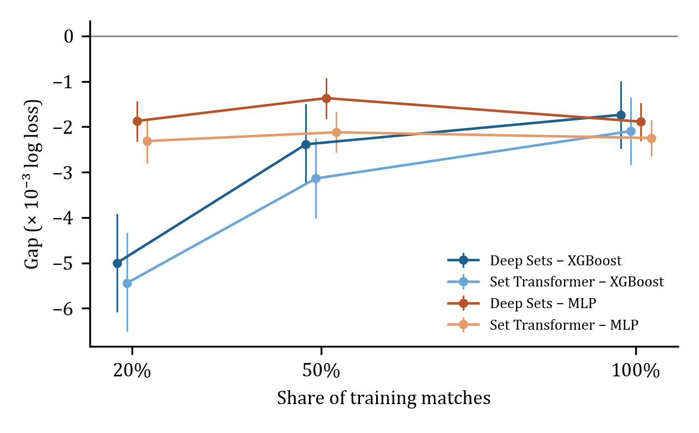

# CS2RB: Aggregate and Individual-Player Models for Round-Win Prediction in Counter-Strike 2

## Introduction

Round-win probability models show Counter-Strike analysts how each kill, plant and rotation changes a round's outlook. Model builders can summarise each team in aggregate features or give the model every player's position, view and movement. Prior CS:GO work found aggregate models competitive. We ask how the advantage of individual-player models changes as training data grow, using a new public Counter-Strike 2 benchmark.

## Methods

CS2RB v1.0 contains 4,768,984 states, sampled about every five seconds of live play, from 12,742 professional map recordings (5,725 matches, seven maps, January–August 2026). Real-time rules remove states in which the round is already decided. On 962 rounds re-parsed from raw recordings, the rules keep 99.9% of live states and leave 0.7% post-decision states. Matches are split chronologically per map (70/15/15), and a pre-registered holdout of 1,536 later matches (19 August–25 September) tests the result on untouched data. Two aggregate models (XGBoost and an MLP, on 28 team features) and two set models (Deep Sets and a Set Transformer, on the same features plus ten player vectors) are trained on nested 20%, 50% and 100% subsets of the training matches. With four seeds each, this gives 336 fits; models are chosen on validation data only.

## Results

Pooled over maps, both set models beat both aggregate models at every scale (Table 1, Figure 1). Against XGBoost the advantage shrinks by 60–65% as data grow, because gradient boosting gains most from more matches. Against the MLP it stays near 2 × 10⁻³. For the validation-selected pair, the advantage is 2.33 × 10⁻³ at 20% and 1.74 × 10⁻³ at 100%, a change indistinguishable from zero. On the holdout, the same models reproduce the full-scale advantage (1.73 × 10⁻³, 95% interval 1.22–2.23). The advantage survives tuned aggregate baselines, and per-player spatial state adds value only at full scale. A pre-specified breakdown places the edge before the bomb plant and after the opening kills.

**Table 1.** Pooled test log loss, set model minus aggregate model (× 10⁻³; 95% interval). Negative favours the set model.

| Pair | 20% of matches | 100% of matches | Change |
|---|---:|---:|---:|
| Validation-selected | −2.33 [−2.78, −1.90] | −1.74 [−2.41, −1.09] | +0.59 [−0.17, +1.35] |
| Deep Sets − XGBoost | −5.00 [−6.08, −3.91] | −1.74 [−2.48, −1.00] | +3.27 [+2.31, +4.23] |
| Set Transformer − XGBoost | −5.45 [−6.51, −4.34] | −2.10 [−2.84, −1.35] | +3.35 [+2.38, +4.30] |
| Deep Sets − MLP | −1.87 [−2.33, −1.43] | −1.89 [−2.31, −1.47] | −0.02 [−0.52, +0.49] |
| Set Transformer − MLP | −2.31 [−2.81, −1.82] | −2.25 [−2.66, −1.85] | +0.07 [−0.44, +0.56] |

**Figure 1.** Pooled gaps by share of training matches (four-seed means, 95% intervals).

## Conclusion

Individual-player models hold a small, persistent edge for round-win prediction in Counter-Strike 2, replicated on later, untouched matches. The apparent convergence with more data reflects gradient boosting's larger gain from data, not lost player-level information. Representation comparisons should report more than one aggregate baseline across training scales. Data, code and all model outputs:

https://github.com/williambishop-research/cs2rb
